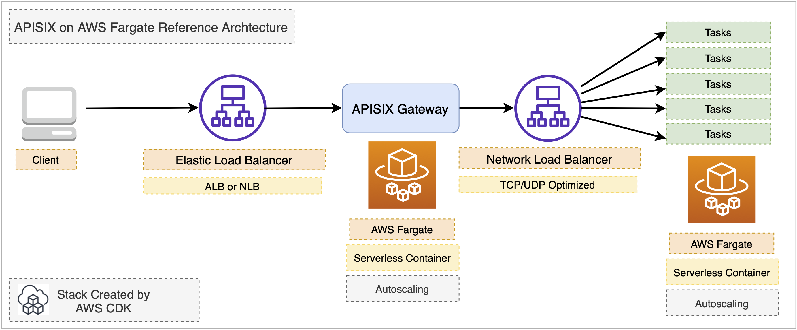

[](https://badge.fury.io/js/cdk-apisix)
[](https://badge.fury.io/py/cdk-apisix)


# cdk-apisix

CDK construct library to generate serverless [Apache APISIX](https://github.com/apache/apisix) workload on AWS Fargate



# sample

```ts
import { Apisix } from 'cdk-apisix';

// create a standard apisix service
const apisix = new Apisix(stack, 'apisix-demo')

// create a sample webservice with apisix in the same Amazon ECS cluster
apisix.createWebService('flask', {
  environment: {
    PLATFORM: 'Apache APISIX on AWS Fargate'
  },
  image: ContainerImage.fromRegistry('public.ecr.aws/pahudnet/flask-docker-sample'),
} )
```
## deploy with required context variables

```sh
cdk deploy \
-c ADMIN_KEY_ADMIN=*********** \
-c ADMIN_KEY_VIEWER=*********** \
-c DASHBOARD_ADMIN_PASSWORD=*********** \
-c DASHBOARD_USER_PASSWORD=***********
```


## custom container image from local assets

```ts
new Apisix(stack, 'apisix-demo', {
  apisixContainer: ContainerImage.fromAsset(path.join(__dirname, '../apisix_container')),
  dashboardContainer: ContainerImage.fromAsset(path.join(__dirname, '../apisix_dashboard')),
});
```
